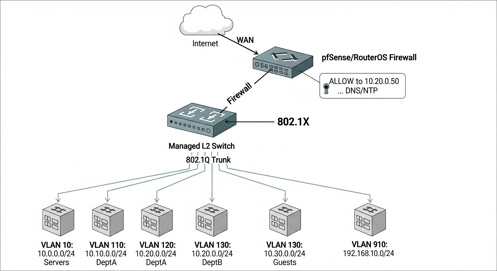

Junior SysAdmin Task – Network Segmentation and Control

Цел
- Разделяне на 5 мрежи: 10.0.0.0/24, 10.10.0.0/24, 10.20.0.0/24, 10.30.0.0/24 и 192.168.10.0/24
- Ограничена свързаност между мрежите (по IP/MAC на машини)
- Контрол на трафика, включително ограничаване на Интернет достъп
- Подбор на хардуер, ОС, технологии и инструменти + схема

Архитектура (високо ниво)
- L3 edge router/firewall с VLAN-и и междумрежови правила (ACL/Firewall)
- Managed L2 switch(es) с 802.1Q VLAN tagging
- Wireless APs с VLAN SSID map (ако е приложимо)
- Централизиран DHCP сървър с резервации (IP-MAC binding) за всяка машина
- (Опционално) 802.1X/MAB за порт-базирана автентикация
- DNS филтриране/прокси за контрол на Интернет

Препоръчан хардуер / софтуер
- Edge firewall/router: Netgate 6100 (pfSense Plus) или MikroTik RB4011 (RouterOS)
- Switch: 1× Managed L2 (например TP-Link Omada, MikroTik CRS, Ubiquiti)
- AP: UniFi 6 Lite/Pro или Omada, с VLAN‑aware SSID
- ОС/Платформа: pfSense CE/Plus (FreeBSD) или RouterOS; алтернатива OpenWrt
- Инструменти: DHCP (вграден), DNS филтър (pfBlockerNG/Unbound + RPZ, Pi‑hole), FreeRADIUS (802.1X), syslog, NTP

Логическо разделение (VLAN-и и подсети)
- VLAN 10 → 10.0.0.0/24
- VLAN 110 → 10.10.0.0/24
- VLAN 120 → 10.20.0.0/24
- VLAN 130 → 10.30.0.0/24
- VLAN 910 → 192.168.10.0/24
Всеки VLAN има SVI/интерфейс на firewall-а: 10.x.0.1/24 (или 192.168.10.1/24)

Диаграма

SVG версия за скалиране: [diagram_sysadmin.svg](diagram_sysadmin.svg)

Забележки:
- Диаграмата визуализира Internet → Edge firewall/router → Managed L2 switch → пет VLAN-а (10.0.0.0/24, 10.10.0.0/24, 10.20.0.0/24, 10.30.0.0/24, 192.168.10.0/24) с 802.1Q tagging.
- Показани са: default inter‑VLAN DROP, DHCP с IP↔MAC резервиране, 802.1X/MAB, VLAN‑aware SSID, Guests → WAN only (BLOCK RFC1918), Admin → full access, DNS filtering/pfBlockerNG, Squid, Syslog/NetFlow, LAG и CARP/VRRP (optional).
- В текста по‑долу остават примерните ACLи (DeptA→DeptB pinholes и др.).

Уточнения към диаграмата
- 802.1X: ако в изображението виждате „802.X“, приемете го като „802.1X“ (типографска грешка в надписа). Самата технология е IEEE 802.1X.
- Примерни pinhole правила: картинката показва илюстративно „ALLOW …, DNS/NTP“. Каноничните примери остават:
  - Admin (192.168.10.0/24) → any: ALLOW
  - DeptA (10.10.0.0/24) → 10.20.0.50:443 и 10.20.0.60:5432: ALLOW (останалото DROP)
  - DeptB (10.20.0.0/24) → 10.0.0.10:445 + DNS/NTP: ALLOW (останалото DROP)
  - Guests (10.30.0.0/24) → WAN only; BLOCK към RFC1918
  Т.е. „ALLOW към 10.20.0.50 …“ в изображението е само пример; политиката по подразбиране между VLAN-ите е DROP и се отварят само конкретните нужни портове/хостове, както е описано горе.

  Допълнителни услуги/разположения:
  • RADIUS (FreeRADIUS) в Servers/Admin VLAN за 802.1X/MAB (порт-базова автентикация)
  • Pi-hole/Proxy (Squid) в отделен VLAN или на FW; Guests → WAN only (RFC1918 BLOCK)
  • LAG/Link aggregation (optional) между FW ↔ Switch; CARP/VRRP за HA (optional)

DHCP + IP/MAC фиксации
- За всяка машина: статичен lease (MAC → фиксиран IP) в DHCP на firewall-а
- Enforce static ARP (по желание) за критични сегменти
- DNS: различни профили по VLAN (например, филтри за Guests)

Контрол на свързаността (между VLAN-и)
Примерни правила (pfSense/MikroTik стил):
- Default междумрежови правила: DROP (изолация по подразбиране)
- Разрешения (пример):
  - Admin (192.168.10.0/24) → full към всички останали VLAN-и
  - DeptA (10.10.0.0/24) → достъп само до конкретни IP в DeptB (10.20.0.50:443, 10.20.0.60:5432)
  - DeptB (10.20.0.0/24) → достъп само до споделени ресурси (10.0.0.10:445) и DNS/NTP
  - Guests (10.30.0.0/24) → само Internet, забранено към вътрешните VLAN-и
- IP/MAC специфични правила: alias групи по MAC/IP; правила „source = host_X, MAC = mac_X“
- Логване на блокирания трафик за одит

Забележка: pfSense по подразбиране има allow правило на LAN-подобни интерфейси – изрично изградете deny-by-default политика на всеки VLAN интерфейс. Съпоставянето по MAC е валидно на входящия интерфейс (след routing MAC се променя), затова го прилагайте на съответния VLAN.

Контрол на Интернет
- DNS филтри (pfBlockerNG/Unbound RPZ; алтернатива Pi‑hole в отделен VLAN)
- Layer 7 прокси (Squid) за allow/deny списъци и категории (по отделни VLAN-и)
- Time‑based правила (например Guests позволени 08:00–20:00)
- Rate limiting/queue (HFSC/FQ‑CoDel) за гарантирани скорости per VLAN

Guests → WAN only: изрично BLOCK към RFC1918 (10.0.0.0/8, 172.16/12, 192.168/16), ALLOW само към WAN (80/443/53/123).

Достъп по потребителски роли
- 802.1X (dot1x) или MAC Authentication Bypass на switch-а
- FreeRADIUS (Users/Groups) → dynamic VLAN assignment (Guests/DeptA/DeptB/Admin)
- На портовете без 802.1X → lock по MAC + DHCP reservations

Мониторинг и одит
- Централизиран syslog (firewall, switch, AP)
- NetFlow/Traffic accounting (на firewall-а)
- SmokePing/ICMP мониторинг към критични адреси

Стъпки за реализация
1) Проектиране на VLAN-и и адресиране; дефиниране на роли/групи
2) Конфигурация на firewall-а: SVI интерфейси, DHCP scopes + reservations, DNS/NTP
3) Конфигурация на L2 switch: trunk към firewall, access портове по VLAN, 802.1Q
4) (Опц.) FreeRADIUS + 802.1X/MAB; dynamic VLAN
5) Firewall policy: „deny any“ по подразбиране между VLAN-и; добавяне на разрешителни ACL по роли/IP/MAC
6) Интернет политики: DNS филтри, прокси (ако е нужно), правила по време, rate limits
7) Мониторинг: syslog/NetFlow/alerts
8) Тестване: чеклист за свързаност по роли и изтичане на политики

Примери за правила (pfSense нотация)
- Guests → any (RFC1918): BLOCK
- Guests → WAN: ALLOW (ports 80/443/53/123)
- DeptA → DeptB: ALLOW dst 10.20.0.50:443, 10.20.0.60:5432
- DeptB → 10.0.0.10:445: ALLOW
- Admin → any: ALLOW
- Specific host (MAC 00:11:22:33:44:55): ALLOW to Internet, BLOCK to internal

Сигурност и поддръжка
- Backup на конфигурацията (firewall/switch) и version control (например Ansible playbooks)
- RBAC на firewall-а; MFA за администратори
- Документация: диаграми, таблици с IP/MAC/потребители
